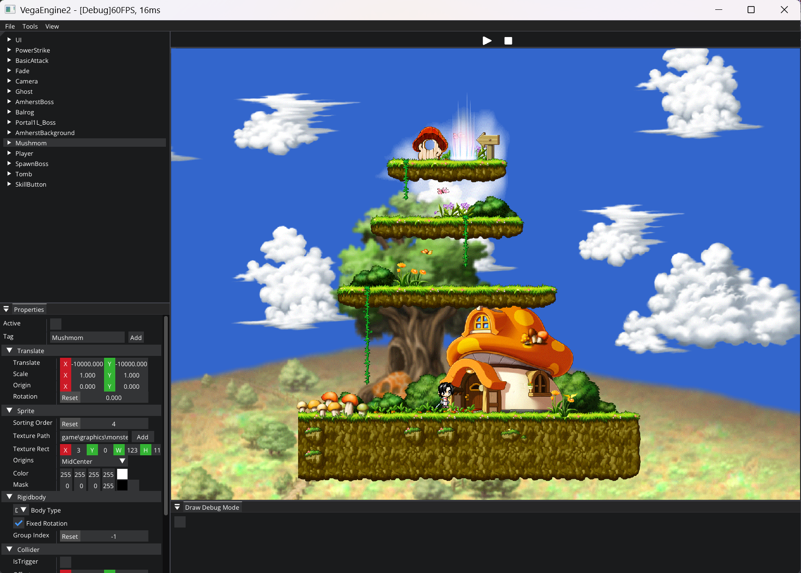
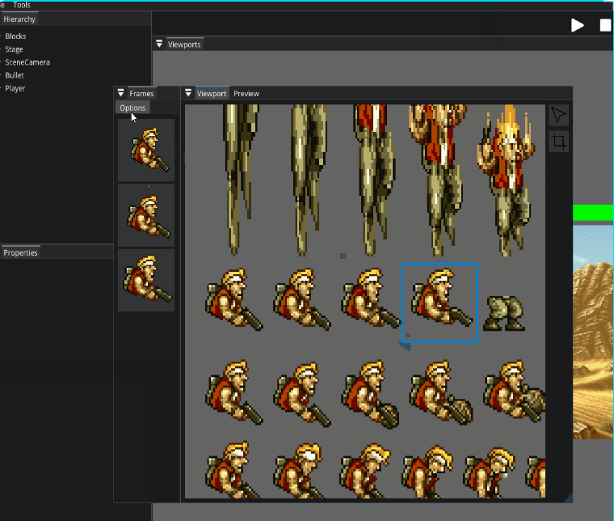
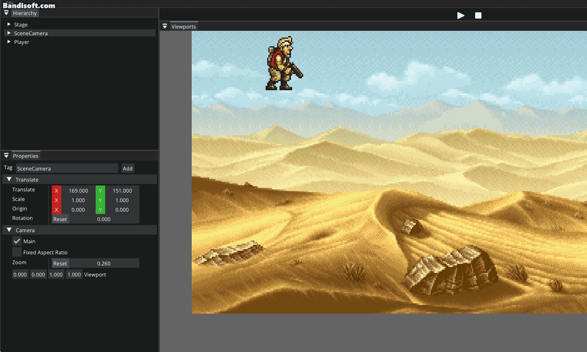
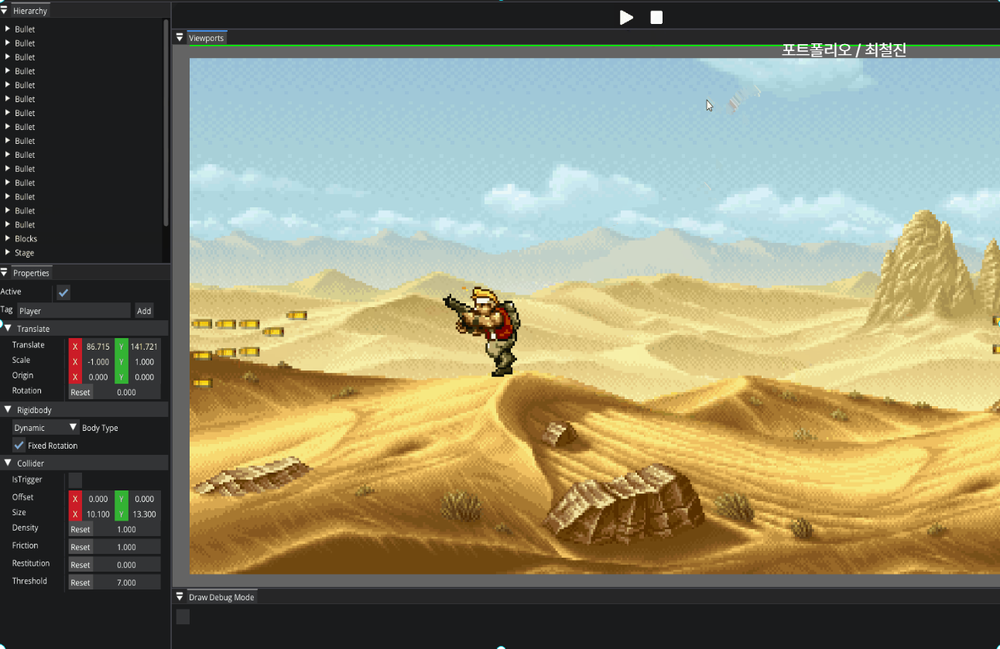

# 2D Vega Engine (Beta version)

Vega Engine은 간단한 2D 게임 개발을 목표로 제작된 경량 C++ 기반 게임 엔진입니다. 
직접 제작한 이 엔진은 정적 스크립트 시스템, Sprite 편집 기능, 물리 컴포넌트, 씬 관리 시스템 등을 제공하여, 
기본적인 2D 게임 로직을 빠르게 구현할 수 있도록 설계되었습니다. 

오픈소스 라이브러리들과 결합하여 ECS(Entity-Component-System) 구조, 렌더링, 입력 처리 등의 핵심 기능을 갖추고 있으며, 
간단한 프로토타입 게임이나 학습용 프로젝트에 적합한 구조로 구현되어 있습니다.  

---
## 시연 영상
- https://youtu.be/znGyzn23iWI

---
## 사용된 주요 라이브러리 및 기술 스택

- **렌더러**: SFML (2D 그래픽 및 입력 처리)
- **물리 엔진**: Box2D (충돌 판정 및 물리 시뮬레이션)
- **Editor UI**: ImGui (실시간 편집기 GUI)
- **ECS 아키텍처**: entt (Entity-Component-System)
- **데이터 저장**: nlohmann/json (씬 저장 및 Prefab 직렬화 등)
- **로그 시스템**: fzlog (자체 제작 경량 로깅 시스템)

## 주요 기능
### **Sprite Editor**

- 엔진 내 모든 설정은 ImGui 기반의 UI에서 조작할 수 있습니다.
- 엔티티 생성, 컴포넌트 추가, 트랜스폼 조정 등 대부분의 편집 작업이 실시간으로 가능합니다.

### **2D Physics System**

- 엔진의 물리 시스템입니다.
- Box2D가 적용되어 있으며, 에디터 상에서 컴포넌트 단위로 조합 가능합니다.
  
### **유니티의 Initiate 및 Prefab 기능**

- 게임 오브젝트의 초기화 및 Prefab 기능을 제공합니다.
- Prefab을 사용하여 여러 오브젝트를 재사용 가능하게 만들어 효율적인 게임 개발을 돕습니다.

### **ECS (Entity-Component-System)**
- **ECS 아키텍처**가 추가되어 성능과 확장성이 크게 향상되었습니다.
- **Entity**(엔티티)와 **Component**(컴포넌트), **System**(시스템)으로 구성된 구조를 통해 게임 로직을 분리하고 최적화할 수 있습니다.
- 게임의 오브젝트와 관련된 데이터를 **컴포넌트**로 분리하고, 이를 처리하는 **시스템**을 통해 효율적으로 데이터를 관리합니다.
- ECS는 특히 **성능 최적화**가 중요한 대규모 프로젝트에서 유용합니다.

### **정적 스크립트 시스템**
- C++ 기반의 정적 바인딩 방식을 사용해 게임 로직을 작성합니다.
- 클래스 단위의 오브젝트 제어, 충돌 처리, 사용자 정의 행동 구현이 가능합니다.

### **입력 처리 시스템**
- 키보드, 마우스 입력을 컴포넌트 단위로 처리 가능하며, 유니티의 InputManager처럼 이벤트 기반 처리를 지원합니다.

### **Transform 컴포넌트 시스템**
- 위치, 회전, 스케일 정보를 컴포넌트로 분리하여 관리합니다.
- 계층적 구조(Hierarchy)를 지원하여, 부모-자식 오브젝트 관계 표현이 가능합니다.

### **디버그 & 로깅 시스템**
- 콘솔 출력을 통해 런타임 상태 확인이 가능합니다.
- 특정 조건에 따라 로그 필터링, 에러 메시지 강조 기능을 지원합니다.

### **모듈형 구조 & 멀티 씬 지원**
- 렌더링, 물리, UI 등 각 시스템이 독립 모듈로 구성되어 유지보수가 용이합니다.
- 멀티 씬 시스템을 통해 씬 단위로 프로젝트를 관리할 수 있습니다.
